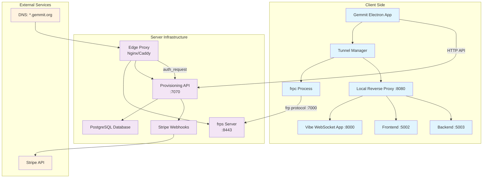

# Design Document

## Overview

The tunnel management system extends Gemmit's capabilities by providing secure, shareable tunnels for local development environments. The system architecture consists of three main components:

1. **Server Infrastructure**: Node.js/Express API with PostgreSQL database for tunnel provisioning, user management, and Stripe integration
2. **Edge Proxy**: Nginx or Caddy reverse proxy with authentication middleware for paywall enforcement
3. **Client Integration**: Enhanced Gemmit Electron application with tunnel management capabilities

The system enables developers to expose local services (vibe app on :8000, frontend on :5002, backend on :5003) through human-readable subdomains like `vibe-lunar-orchid-lab-q7.gemmit.org`, with optional monetization through Stripe subscriptions.

## Architecture



## Components and Interfaces

### 1. Server-Side Components

#### 1.1 Tunnel Name Generator (`server/namegen.js`)

**Purpose**: Generate deterministic, collision-proof subdomain names using cryptographic methods.

**Key Functions**:
- `makeTunnelName({ words, checksumBits, deterministicSeed, role })`: Main name generation function
- `chooseWords(sourceBuf, count)`: Select BIP39 words using cryptographic randomness
- `toBase32(buf, bits)`: Generate base32 checksum for collision resistance

**Algorithm**:
1. Use deterministic seed: `u:${userId}|p:${projectId}|role:${role}|v1|nonce:${attempt}`
2. Generate 5 BIP39 words (55 bits entropy)
3. Add 10-bit base32 checksum
4. Format: `${role}-${words.join('-')}-${checksum}`

**Collision Handling**: Retry with incremented nonce (up to 5 attempts) if database unique constraint fails.

#### 1.2 Provisioning API (`server/index.js`)

**Express Server Configuration**:
```javascript
const app = express();
app.use(bodyParser.json());
const pool = new pg.Pool({ connectionString: process.env.DATABASE_URL });
```

**Core Endpoints**:

1. **POST /api/tunnels/reserve**
   - Input: `{ userId, projectId }`
   - Output: `{ tunnels: [{ role, name, url, localPort, status }] }`
   - Logic: Upsert tunnels for all three roles (vibe, fe, be)

2. **GET /entitlement/check**
   - Input: Host header (e.g., `vibe-lunar-orchid-lab-q7.gemmit.org`)
   - Output: HTTP status codes (204/402/403/404) + X-User-Id header
   - Logic: Extract subdomain, query database, check status

3. **POST /stripe/webhook**
   - Input: Stripe webhook payload
   - Output: `{ received: true }`
   - Logic: Map subscription status to tunnel status, update database

#### 1.3 Database Schema

**PostgreSQL Tables**:
```sql
-- Users table
CREATE TABLE users (
    id BIGSERIAL PRIMARY KEY,
    email TEXT UNIQUE NOT NULL,
    created_at TIMESTAMPTZ DEFAULT NOW()
);

-- Projects table  
CREATE TABLE projects (
    id BIGSERIAL PRIMARY KEY,
    user_id BIGINT REFERENCES users(id) ON DELETE CASCADE,
    name TEXT NOT NULL,
    created_at TIMESTAMPTZ DEFAULT NOW()
);

-- Tunnel roles enum
CREATE TYPE tunnel_role AS ENUM ('vibe','fe','be');

-- Tunnels table
CREATE TABLE tunnels (
    id BIGSERIAL PRIMARY KEY,
    user_id BIGINT REFERENCES users(id) ON DELETE CASCADE,
    project_id BIGINT REFERENCES projects(id) ON DELETE CASCADE,
    role tunnel_role NOT NULL,
    name TEXT NOT NULL UNIQUE,
    status TEXT NOT NULL DEFAULT 'inactive',
    local_port INTEGER NOT NULL,
    created_at TIMESTAMPTZ DEFAULT NOW()
);

CREATE INDEX tunnels_by_name ON tunnels(name);
```

### 2. Edge Proxy Configuration

#### 2.1 Nginx Configuration (`/etc/nginx/conf.d/gemmit.conf`)

**Authentication Flow**:
```nginx
server {
    listen 443 ssl http2;
    server_name *.gemmit.org;
    
    # SSL configuration
    ssl_certificate /etc/letsencrypt/live/gemmit.org/fullchain.pem;
    ssl_certificate_key /etc/letsencrypt/live/gemmit.org/privkey.pem;
    
    # Authentication check
    auth_request /_entitlement_check;
    error_page 401 403 402 = @paywall;
    
    # Internal auth endpoint
    location = /_entitlement_check {
        internal;
        proxy_pass http://127.0.0.1:7070/entitlement/check;
        proxy_set_header Host $host;
        proxy_set_header X-Original-URI $request_uri;
        proxy_set_header X-Forwarded-For $remote_addr;
    }
    
    # Main proxy to frps
    location / {
        proxy_pass https://127.0.0.1:8443;
        proxy_set_header Host $host;
        proxy_ssl_server_name on;
        proxy_ssl_verify off;
        proxy_read_timeout 3600s;
    }
    
    # Paywall redirect
    location @paywall {
        proxy_pass http://127.0.0.1:7070/paywall;
    }
}
```

#### 2.2 Alternative Caddy Configuration

**Forward Auth Setup**:
```caddyfile
*.gemmit.org {
    route {
        forward_auth http://127.0.0.1:7070/entitlement/check
        reverse_proxy https://127.0.0.1:8443 {
            header_up Host {host}
            transport http {
                tls
                tls_insecure_skip_verify
            }
        }
    }
    handle_response 401,403,402 {
        reverse_proxy http://127.0.0.1:7070
        rewrite * /paywall
    }
}
```

### 3. frps Server Configuration

#### 3.1 Server Configuration (`/etc/frps/frps.ini`)

```ini
[common]
bind_port = 7000
vhost_http_port = 8081
vhost_https_port = 8443
subdomain_host = gemmit.org
token = SUPERSECRET
```

#### 3.2 Systemd Service (`/etc/systemd/system/frps.service`)

```ini
[Unit]
Description=frp server
After=network.target

[Service]
ExecStart=/usr/local/bin/frps -c /etc/frps/frps.ini
Restart=always
User=frp

[Install]
WantedBy=multi-user.target
```

### 4. Client-Side Integration

#### 4.1 Gemmit Electron Application Enhancement

**New Components to Add**:

1. **Tunnel API Client** (`desktop/src/tunnelApi.js`)
   - `reserveTunnels({ apiBase, userId, projectId })`: Call reservation API
   - Handle HTTP errors and network failures
   - Cache tunnel configurations locally

2. **Tunnel Manager** (`desktop/src/tunnelManager.js`)
   - `runFrpc({ serverHost, serverPort, token, tunnels })`: Manage frpc processes
   - `buildFrpcIni({ serverHost, serverPort, token, tunnels })`: Generate configuration
   - Process lifecycle management using existing patterns

3. **Local Reverse Proxy** (`desktop/src/proxy.js`)
   - HTTP server on port 8080
   - Route `/api/alt/*` → backend (:5003)
   - Route `/api/*` → vibe WebSocket app (:8000)  
   - Route `/*` → frontend (:5002)
   - WebSocket upgrade support for vibe app communication

#### 4.2 UI Integration Points

**Chat Interface Enhancements**:
- Add tunnel management buttons to existing topbar
- Display tunnel status and URLs in chat interface
- Integrate with existing WebSocket communication patterns

**Configuration Integration**:
- Extend existing settings system for tunnel configuration
- Store API endpoints and credentials securely
- Leverage existing project directory management

#### 4.3 Process Management Integration

**Leverage Existing Infrastructure**:
- Use existing `tree-kill` library for process termination
- Follow existing process tracking patterns from backend management
- Integrate with existing cleanup handlers (`before-quit`, `SIGINT`, `SIGTERM`)

**Enhanced Process Tracking**:
```javascript
// Extend existing process management
let tunnelProc;

function startTunnels(config) {
    tunnelProc = runFrpc(config);
    // Integrate with existing cleanup
}

function cleanupTunnels() {
    if (tunnelProc?.proc?.pid) {
        kill(tunnelProc.proc.pid, 'SIGTERM');
    }
}
```

## Data Models

### 1. Tunnel Configuration Model

```javascript
{
    role: 'vibe' | 'fe' | 'be',
    name: 'vibe-lunar-orchid-lab-q7',
    url: 'https://vibe-lunar-orchid-lab-q7.gemmit.org',
    localPort: 8000 | 5002 | 5003,
    status: 'active' | 'trial' | 'past_due' | 'canceled' | 'inactive'
}
```

### 2. frpc Configuration Model

```ini
[common]
server_addr = gemmit.org
server_port = 7000
token = SUPERSECRET

[vibe]
type = http
local_port = 8000
subdomain = vibe-lunar-orchid-lab-q7

[fe]
type = http
local_port = 5002
subdomain = fe-lunar-orchid-lab-q7

[be]
type = http
local_port = 5003
subdomain = be-lunar-orchid-lab-q7
```

### 3. API Response Models

**Tunnel Reservation Response**:
```javascript
{
    tunnels: [
        {
            role: 'vibe',
            name: 'vibe-lunar-orchid-lab-q7',
            url: 'https://vibe-lunar-orchid-lab-q7.gemmit.org',
            localPort: 8000,
            status: 'trial'
        },
        // ... fe and be tunnels
    ]
}
```

## Error Handling

### 1. Server-Side Error Handling

**Database Errors**:
- Unique constraint violations → retry with incremented nonce
- Connection failures → return HTTP 500 with retry guidance
- Query timeouts → implement connection pooling and timeouts

**API Errors**:
- Invalid input → HTTP 400 with validation details
- Authentication failures → HTTP 401/403 with clear messaging
- Rate limiting → HTTP 429 with retry-after headers

### 2. Client-Side Error Handling

**Network Errors**:
- API unreachable → fallback to cached configurations, show offline status
- Timeout errors → implement exponential backoff retry logic
- DNS resolution failures → provide troubleshooting guidance

**Process Errors**:
- frpc binary missing → download and install automatically
- Port conflicts → detect and suggest alternative ports
- Permission errors → provide clear instructions for resolution

### 3. Edge Proxy Error Handling

**Authentication Errors**:
- Invalid tokens → redirect to paywall with clear messaging
- Expired subscriptions → show payment required page
- Service unavailable → show maintenance page

## Testing Strategy

### 1. Unit Testing

**Server Components**:
- Name generation algorithm correctness and collision resistance
- Database operations with mock PostgreSQL
- API endpoint behavior with various inputs
- Stripe webhook processing with test payloads

**Client Components**:
- Tunnel configuration generation
- Process management lifecycle
- API client error handling
- Local proxy routing logic

### 2. Integration Testing

**End-to-End Flows**:
- Complete tunnel reservation and activation flow
- Payment processing and status updates
- Process cleanup on application shutdown
- Cross-platform compatibility (macOS, Windows, Linux)

**API Integration**:
- Server API with real PostgreSQL database
- Stripe webhook integration with test environment
- Edge proxy authentication flow
- frps server connectivity

### 3. Load Testing

**Performance Scenarios**:
- Concurrent tunnel reservations
- High-frequency entitlement checks
- Multiple frpc connections per server
- Database performance under load

### 4. Security Testing

**Vulnerability Assessment**:
- SQL injection prevention in database queries
- Stripe webhook signature verification
- Rate limiting effectiveness
- Process isolation and privilege escalation prevention

## Deployment Considerations

### 1. Server Infrastructure

**Requirements**:
- VPS with public IP and domain control
- PostgreSQL database (managed or self-hosted)
- SSL certificates for *.gemmit.org
- Stripe account with webhook endpoints configured

**Scaling Considerations**:
- Database connection pooling for high concurrency
- Multiple frps instances behind load balancer
- CDN for static paywall pages
- Monitoring and alerting for service health

### 2. Client Distribution

**Binary Bundling**:
- Include frpc binaries for all target platforms (macOS, Windows, Linux)
- Automatic updates through existing electron-updater system
- Graceful fallback for missing binaries

**Configuration Management**:
- Environment-specific API endpoints
- Secure credential storage using existing patterns
- User preference persistence in existing settings system

### 3. Monitoring and Observability

**Metrics Collection**:
- Tunnel usage statistics (active tunnels, data transfer)
- API performance metrics (response times, error rates)
- Process health monitoring (frpc uptime, memory usage)
- Payment conversion tracking

**Logging Strategy**:
- Structured logging for all components
- Log aggregation for troubleshooting
- Privacy-conscious logging (no sensitive data)
- Retention policies for compliance